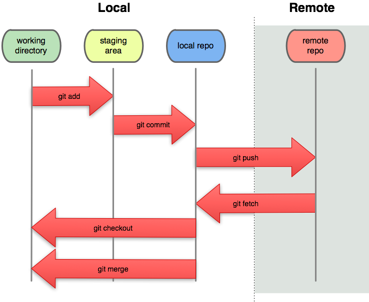

<!-- Google tag (gtag.js) -->
<script async src="https://www.googletagmanager.com/gtag/js?id=G-SJL6EQRW3V"></script>
<script>
  window.dataLayer = window.dataLayer || [];
  function gtag(){dataLayer.push(arguments);}
  gtag('js', new Date());

  gtag('config', 'G-SJL6EQRW3V');
</script>

<!-- _paginate: false -->
<!-- _class: title -->

# 從共編文件到 Agentic Coding

SITCON Camp 2026 先導課程

<div class="title-meta">

## Denny Huang
### 2026/07/08

</div>

---


<div class="lead">https://denny.one/SITCON-Camp-2026-Prep-Course/</div>

---

# Denny Huang

- <a href="https://sitcon.org/" target="_blank">SITCON 學生計算機年會</a> 共同發起人
- <a href="https://coscup.org/" target="_blank">COSCUP 開源人年會</a> 長期志工
- <a href="https://hitcon.org/" target="_blank">HITCON 台灣駭客年會</a> 長期志工
- GDG Cloud Taipei Organizer
- 曾任雷亞遊戲（Rayark Inc.）資料分析團隊主管
- <a href="https://denny.one/" target="_blank">About me</a>

---

# 工具不重要

<div class="big">熟悉流程</div>

- 把想法寫清楚
- 讓隊友和 Agent 看得懂
- 看懂改了什麼
- 留下可追蹤的紀錄

---

# 所有入口

- [Google Docs 共編文件](https://docs.google.com/document/d/1rCpsrLMKc0vtepU2eNusjZl8DBCp_HPttDaMnW1hi_o/edit)
- GitHub 組織：https://github.com/SITCON-Camp-2026
- 公開成果頁：https://sitcon-camp-2026.github.io/prep-course/
- 卡住時：找隊輔或助教

---

# 小隊 repo 命名規則

```text
第 1 小隊：team1-prep-course
第 2 小隊：team2-prep-course
...
第 9 小隊：team9-prep-course
```

請確認：

- 不是 `prep-course`
- 不是別隊的 repo

<div class="checkpoint">檢核點 1：我知道自己的小隊 repo 名稱</div>

---

# 為什麼從 Google Docs 開始？

<div class="lead">軟體工程不只寫程式</div>

- 把想法寫下來
- 讓別人看得懂
- 一起修改
- 保留修改紀錄

---

# Markdown？

<div class="lead">純文字表達結構的寫法</div>

```markdown
## GitHub 帳號

## 顯示名稱

- AI
- 前端
- 開放資料
```

<div class="keywords">標題 / 清單 / 程式碼 / 連結 / 結構化文字</div>

---

# 為什麼需要 Markdown？

<div class="two-col">
<div>

## 人類好讀

- 標題清楚
- 清單好掃讀
- 可以快速修改

</div>
<div>

## Agent 好讀

- 區塊明確
- 欄位穩定
- 容易轉成 JSON

</div>
</div>

<div class="lead">排版，資訊結構化</div>

---

# Google Docs：開啟 Markdown

操作路徑：

```text
工具
→ 偏好設定
→ 啟用 Markdown
→ 確認
```

<div class="checkpoint">檢核點 2：我已開啟 Google Docs 的 Markdown 編寫功能</div>

---

# Profile 草稿

請在 Google Docs 完成：

```markdown
## GitHub 帳號

## 顯示名稱

## 一句話介紹

## 興趣主題

## 技術陣營
```

---

# 公開名片，不寫個資

<div class="two-col">
<div>

## 可以放

- 暱稱
- GitHub 帳號
- 興趣
- 技術陣營

</div>
<div>

## 不要放

- Email / 電話
- 學校班級
- 生日 / 住址
- 不想公開的資訊

</div>
</div>

---

# 技術陣營戰爭

<div class="three-col">
<div class="box">

## OS

Windows
macOS
Linux

</div>
<div class="box">

## Browser

Chrome
Firefox
Edge
Safari

</div>
<div class="box">

## Editor / IDE

VS Code
JetBrains
Vim
Emacs

</div>
</div>

---

# Profile 草稿完成

請確認填好：

- GitHub 帳號
- 顯示名稱
- 一句話介紹
- 興趣主題 1–3 個
- 作業系統 / 瀏覽器 / 編輯器陣營

<div class="checkpoint">檢核點 3：我的 Google Docs profile 草稿已完成</div>

---

# Google Docs 版本紀錄

操作路徑：

```text
檔案
→ 版本記錄
→ 查看版本記錄
```

會看到：

- 是誰
- 在什麼時候
- 改了什麼
- 可以回到舊版本

---

# 從版本紀錄到 commit

<div class="two-col">
<div class="box">

## Google Docs

系統自動記住
每一次變動

</div>
<div class="box">

## Git commit

人主動標記
一次有意義的修改

</div>
</div>

<div class="lead">commit 非自動化，有意義有署名</div>

---

<!-- _class: commit-message -->

# commit message

<div class="lead">版本標題</div>

```text
docs(profile): add profile draft
feat(profile): add my profile
chore(data): generate profile JSON
fix(profile): correct faction code
```

<div class="small">常見格式：type(scope): summary</div>

<div class="checkpoint">檢核點 4：我知道版本紀錄和 commit 的關係</div>

---

# VS Code

- Explorer：看檔案
- Editor：改檔案
- Agent：請 AI 協助
- Source Control：看版本紀錄和差異（diff）
- Terminal：跑指令

---

# 在 VS Code 登入 GitHub

操作路徑：

```text
VS Code 左下角 Accounts
→ Sign in with GitHub
→ 瀏覽器授權
→ 回到 VS Code
```

<div class="checkpoint">檢核點 5：VS Code 左下角看得到 GitHub 帳號</div>

---

# GitHub ≠ Git

<div class="two-col">
<div class="box">

## GitHub 登入

有權限連到 GitHub

</div>
<div class="box">

## Git 作者設定

commit 時的作者名稱和 email

</div>
</div>

---

# 設定 Git 使用者名稱與 email

打開 VS Code Terminal：

```bash
git config --global user.name "你的 GitHub 帳號或顯示名稱"
git config --global user.email "你的 GitHub noreply email 或 GitHub 使用的 email"
```

範例：

```bash
git config --global user.name "octocat"
git config --global user.email "12345678+octocat@users.noreply.github.com"
```

---

# 檢查 Git 設定

```bash
git config --global user.name
git config --global user.email
```

應該看到：

```text
第一行：你的 Git 使用者名稱
第二行：你的 Git email
```

<div class="checkpoint">檢核點 6：我看得到自己的 Git 使用者名稱與 Git email</div>

---

# 找到小隊 repo

操作路徑：

```text
https://github.com/SITCON-Camp-2026
→ Repositories
→ teamX-prep-course
```

確認畫面上是：

```text
SITCON-Camp-2026 / teamX-prep-course
```

---

# Clone 小隊 repo

操作路徑：

```text
GitHub repo 頁面
→ Code
→ HTTPS
→ Copy URL
→ VS Code
→ Source Control
→ Clone Repository
→ 貼上 URL
→ 選資料夾
→ Select as Repository Destination
```

---

# repo 檔案結構

```text
README.md
AGENTS.md
package.json
notes/
profiles/
tasks/
data/
schemas/
src/
```

<div class="checkpoint">檢核點 7：我在 VS Code 看得到小隊 repo</div>

---

# 建立個人草稿檔

操作路徑：

```text
Explorer
→ notes/
→ New File
→ <你的 GitHub 帳號>.md
```

內容：

```text
貼上 Google Docs 的 profile 草稿
```

<div class="checkpoint">檢核點 8：我已建立 notes/&lt;github&gt;.md</div>

---

# 與 Agent 協作

- 讀檔案
- 依照規則轉換資料
- 修改檔案
- 說明它改了什麼

<div class="lead">Agent 協助，但不負責最後決定。</div>

---

# Agent 不是魔法

<div class="two-col">
<div class="box">

## 你給它

`notes/<github>.md`
自然語言草稿

</div>
<div class="box">

## 它產生

`profiles/<github>.json`
程式可讀資料

</div>
</div>

<div class="lead">人類文字 → 結構化資料</div>

---

# Agent 需要知道規則

```text
notes/<github>.md
schemas/profile.schema.json
data/faction-options.json
AGENTS.md
```

下 prompt 前該有的準備：

```text
輸入 / 規則 / 選項 / 協作指示
```

---

# JSON 是什麼？

<div class="lead">讓程式讀得懂的資料格式</div>

```text
自然語言：
我平常用 Linux、Firefox，編輯器喜歡 Vim。
```

```json
{
  "os": "linux",
  "browser": "firefox",
  "editor": "vim"
}
```

---

# JSON 的三個基本概念

```json
{
  "displayName": "小火龍",
  "github": "octocat"
}
```

- 物件 object：`{ }`
- 欄位 key：`displayName`
- 值 value：`小火龍`

---

# 為什麼會常看到 JSON？

- 設定檔
- API 回傳資料
- 前端資料
- Agent 產生內容
- 專案資料交換

<div class="lead">眾多工具和服務之間的共同語言。</div>

---

# JSON 結構嚴謹

常見錯誤：

- 少逗號
- 少引號
- 欄位名稱打錯
- 大小寫不一致
- 多了註解

---

# 固定字串避免混亂

```json
"editor": "vscode"
```

不要變成：

```text
VS Code
vscode
VSCode
Visual Studio Code
```

<div class="lead">人類覺得一樣，機器看不懂</div>

---

# schema - 寫給工具看的規則

- `required`：哪些欄位一定要有
- `enum`：只能使用哪些固定選項
- `validation`：檢查格式是否正確

<div class="lead">不靠人類記住規則，寫下來並讓工具可以使用</div>

---

# 給 Agent 的任務

可複製 prompt：

```text
請閱讀 notes/<我的 GitHub 帳號>.md，
根據 schemas/profile.schema.json
和 data/faction-options.json，
產生 profiles/<我的 GitHub 帳號>.json。

請不要加入我沒有提供的個資。
完成後請告訴我改了哪些檔案。
```

---

# Agent 產生 JSON 之後

請檢查：

- 有沒有產生 `profiles/<github>.json`
- JSON 有沒有紅線
- faction 是否使用小寫代號
- 有沒有多出你沒提供的個資

<div class="checkpoint">檢核點 9：Agent 已產生 profiles/&lt;github&gt;.json</div>

---

# 本機預覽

打開 VS Code Terminal：

```bash
pnpm run dev
```

關鍵輸出：

```text
Local: http://localhost:5173/
```

用瀏覽器打開這個網址。

---

# 本機預覽檢查

請確認：

- 看得到自己的卡片
- GitHub 頭貼有出現
- 顯示名稱正確
- 技術陣營正確
- 統計數字有更新

<div class="checkpoint">檢核點 10：我在本機預覽頁看得到自己的卡片</div>

---

# Agent 會犯錯

可能發生：

- 猜錯陣營
- 改錯 GitHub 帳號
- 過度改寫 tagline
- 新增你沒提供的資訊
- 格式正確但內容錯誤

---

# 看 diff 是人類應盡責任

操作路徑：

```text
Source Control
→ 點選變更的檔案
→ 查看修改差異 diff
```

檢查：

- GitHub 帳號正確嗎？
- 顯示名稱正確嗎？
- 技術陣營正確嗎？
- 有沒有多出個資？

---

# commit

操作路徑：

```text
Source Control
→ Stage Changes
→ 讓 AI 自動產生 commit message
→ Commit
```

<div class="checkpoint">檢核點 11：我已完成第一次 commit</div>

---

<!-- _class: local-remote -->

# commit 還在本機

<div class="two-col">
<div>

<div class="lead">commit 只寫入在本機</div>

需要 push 到 GitHub 才會公開

```text
本機 commit
→ push
→ GitHub repo
→ 公開成果流程
```

</div>
<div>



</div>
</div>

---

# push 前先同步

隊友可能已經先 push 新版本。

建議操作路徑：

```text
Source Control
→ Sync Changes
```

或使用 Terminal：

```bash
git pull --rebase
git push
```

---

# 如果 push 失敗

常見原因：

```text
remote contains work that you do not have locally
```

意思是：

```text
GitHub 上已經有隊友的新 commit
你的本機需要先同步
```

---

# 這時候可以請 Agent 協助

給 Agent 的任務：

```text
請協助我判讀目前 git 狀態。
先不要刪除或覆蓋任何檔案。
請告訴我下一步應該 pull、rebase、resolve conflict，還是 push。
```

<div class="small">Agent 可以協助判讀；最後仍由人類確認 diff 與衝突解法。</div>

---

# push：把 commit 送回 GitHub

操作路徑：

```text
Source Control
→ Sync Changes / Push
```

或使用 Terminal：

```bash
git push
```

<div class="checkpoint">檢核點 12：我已把 commit push 到 GitHub</div>

---

# 公開成果頁

應該看到：

- GitHub 頭貼
- 顯示名稱
- 一句話介紹
- 興趣
- 技術陣營
- 全營隊統計

<div class="checkpoint">檢核點 13：我在成果頁看得到自己的卡片</div>

---

# 其實完成了

```text
想法
→ Markdown 草稿
→ Agent 轉換
→ JSON 資料
→ schema 檢查
→ 本機預覽
→ diff 審查
→ commit 紀錄
→ push 到 GitHub
→ 公開成果
```

---

# 對比軟體工程主線

<div class="two-col">
<div class="box">

## 今天：自己的卡片

- 寫清楚自己的資料
- 讓 Agent 產生 JSON
- 預覽卡片
- 看 diff
- commit / push

</div>
<div class="box">

## 明天：小隊專案

- 寫清楚要改什麼
- 讓 Agent 修改程式
- 預覽功能
- 看 diff
- commit / push

</div>
</div>

<div class="lead">規模變大，協作順序一樣</div>

---

# Q & A

---

<!-- _class: closing -->

# Thanks for listening

<div class="license-credit">

###### 本投影片採用
 <a href="https://creativecommons.org/licenses/by-sa/4.0/deed.zh-hant" target="_blank">創用 CC「姓名標示-相同方式分享 4.0 國際」授權條款</a>釋出
 <a href="https://marp.app/" target="_blank">Marp</a> 製作

</div>
